# Research Portfolio

**Closed-Loop Control Systems Robust to Objective and Environment Shift**

Learning-based network resource management and other closed-loop control that adapt through policy transfer and LLM agents, implemented and validated through Sim2Real

Youngseok Lee · Ph.D. Candidate, Dept. of Electrical & Computer Engineering, Sungkyunkwan University · [yslee.gs@gmail.com](mailto:yslee.gs@gmail.com) · [Google Scholar](https://scholar.google.com/citations?user=GhwtxtgAAAAJ)

[PDF (11 pages)](YoungseokLee_Portfolio.pdf)

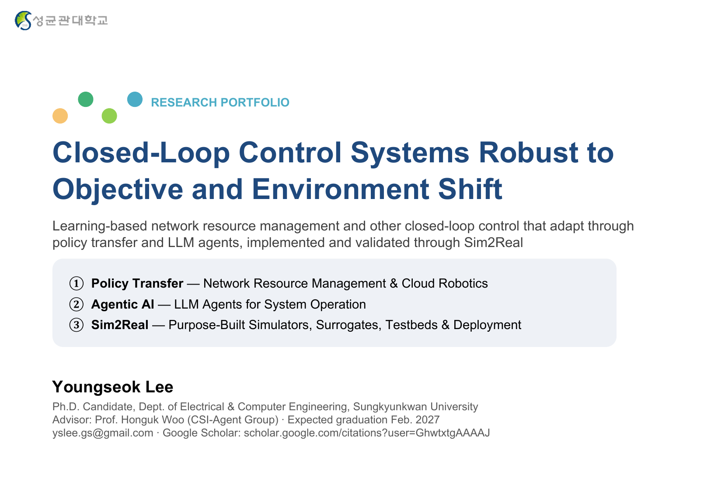

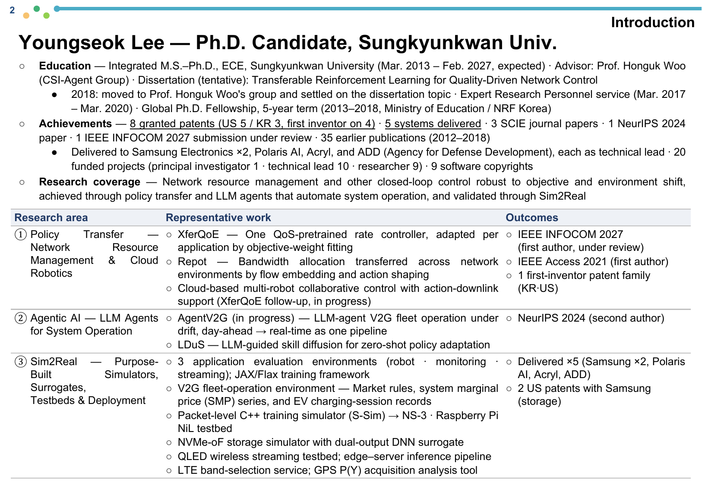

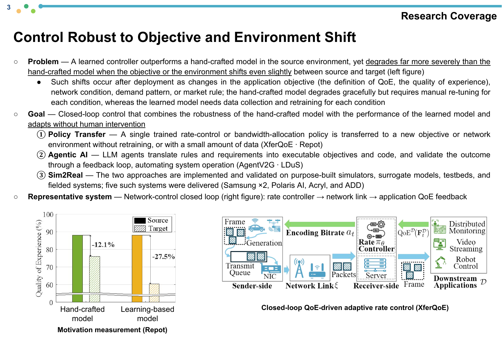

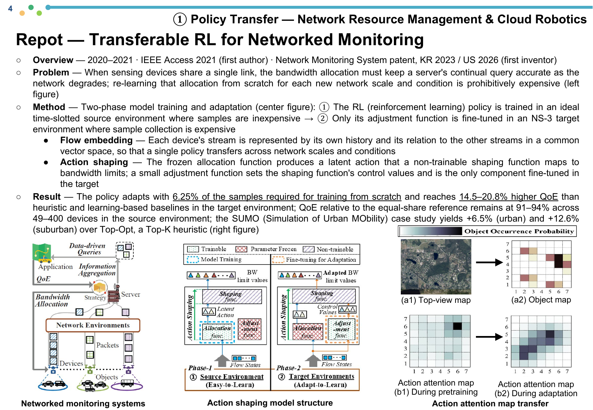

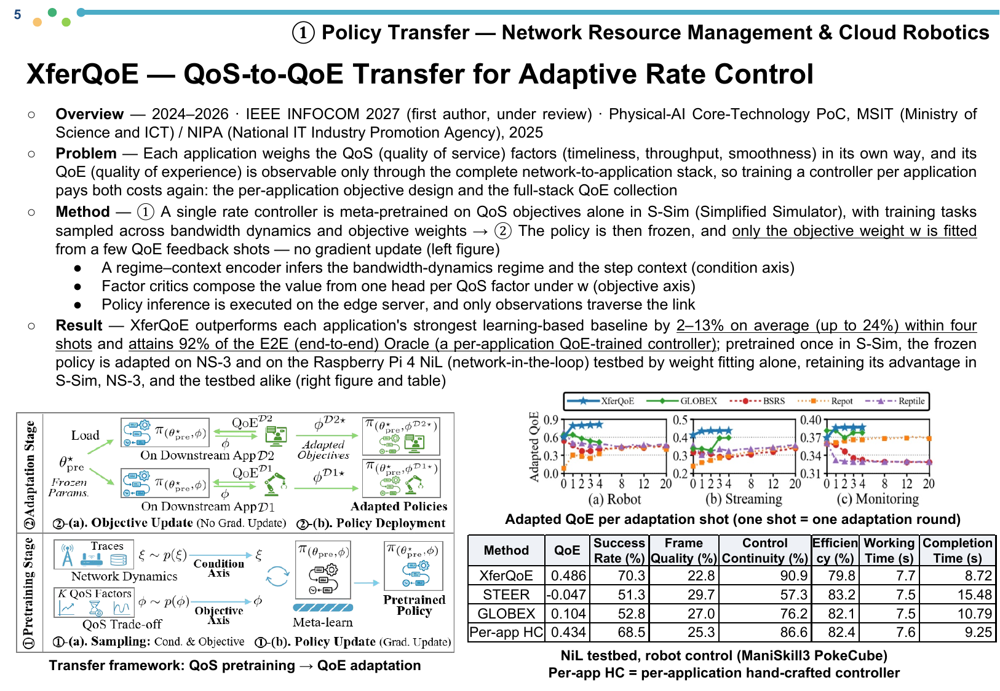

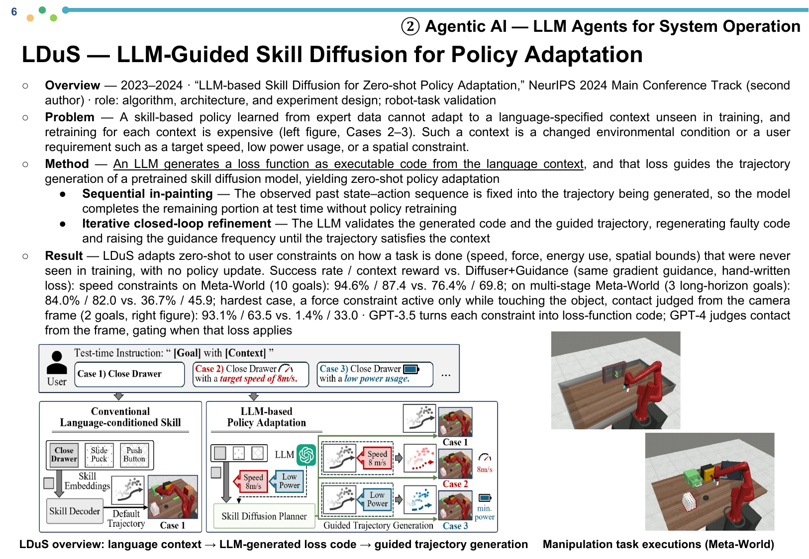

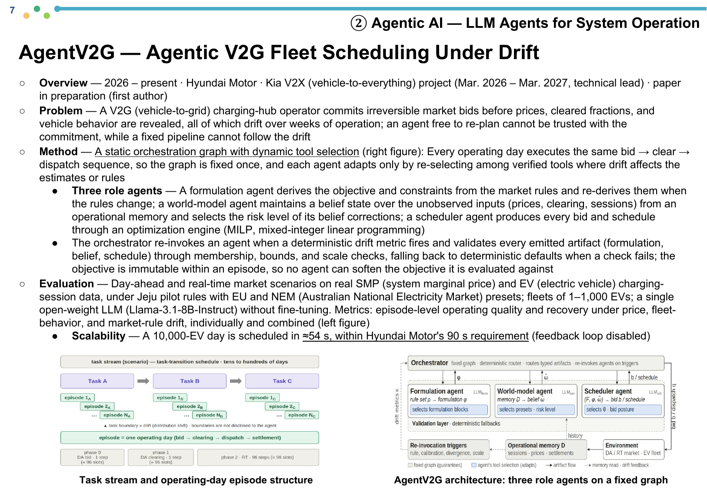

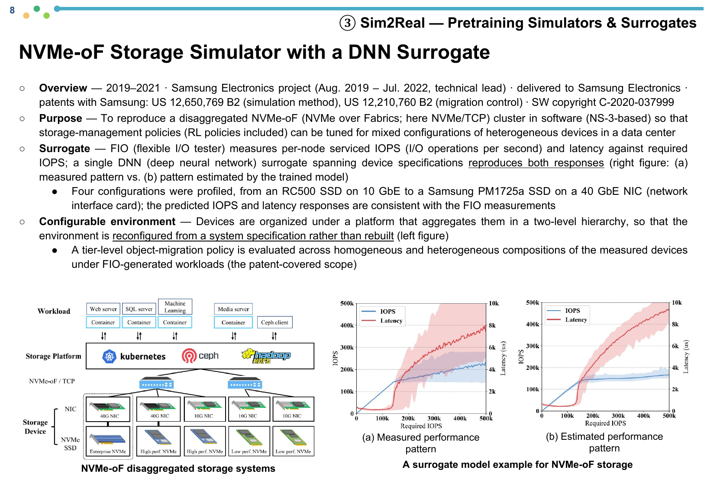

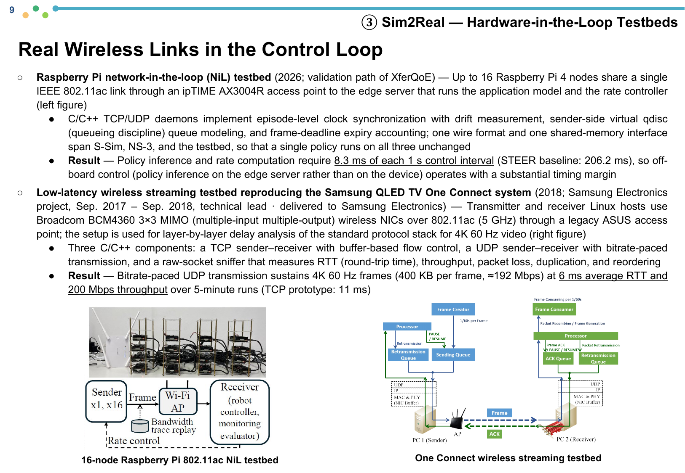

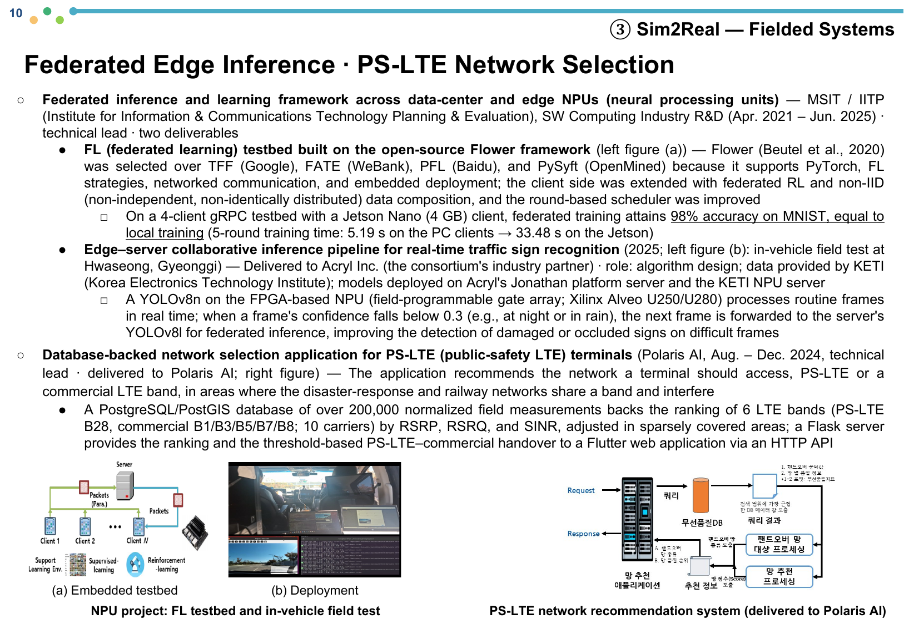

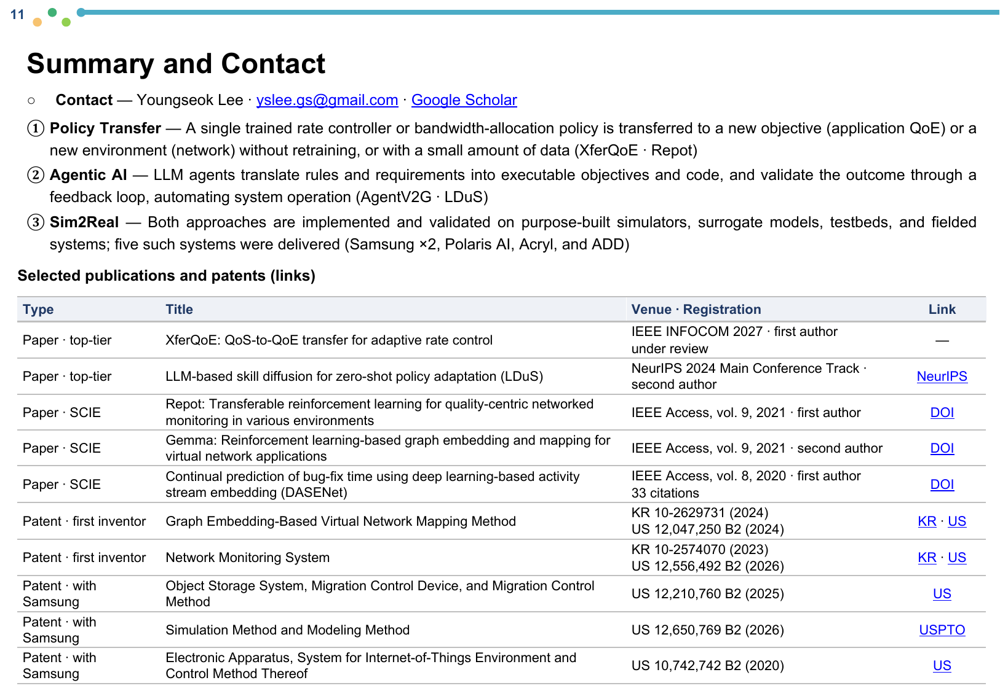
